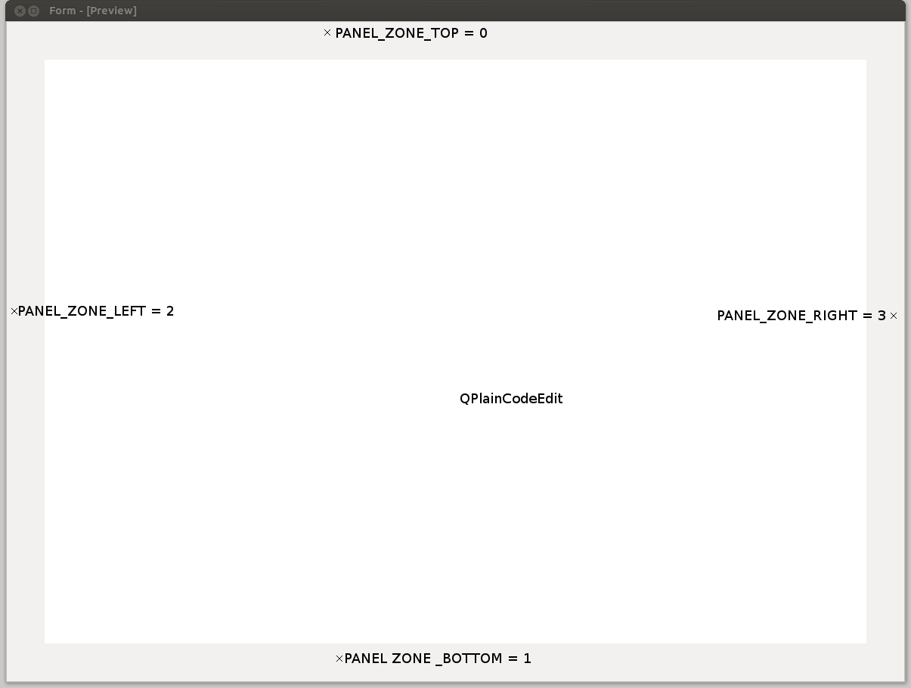

.. PCEF - PySide Code Editing framework
.. Copyright 2013, Colin Duquesnoy <colin.duquesnoy@gmail.com>

.. This document is released under the LGPLv3 license.
.. You should have received a copy of the GNU Lesser General Public License
.. along with this program. If not, see <http://www.gnu.org/licenses/>.

Getting started
===============

This framework aims to keep things simple for the basic user while not preventing advanced user from doing more
complex things.

For that purpose, there is two way to use pcef:

    - using a pre-made editor that already fits your needs (from pcef.editors import)
    - using a raw editor widget where you can install the modes/panels you really need.

In both cases user will always have a way to add a new mode/Panel or to disable already installed one.

.. contents:: :local:

The editor widget
-------------------

The editor widget is not a subclass of a QPlainTextEdit, it's just a regular widget with an ui designed in Qt designer.

The widget ui contains a widget promoted to pcef.qplaincodeedit.CodeEdit and 4 layouts where the panels are
added.

User can retrieve the text edit control by using the textEdit property.

The editor widget provides flexibility by the use of editor extensions. There are two types of extensions:

    - Panel: a Panel is a QWidget that is added to one of the four layouts (top, bottom, left, right)
    - Mode: a mode is an object that adds a new behaviour to the editor usually by connecting to the text edit events.

The text edit is a subclass of a QPlainTextEdit to adds a few new events:
    - newTextSet
    - keyReleased, keyPressed, ....

Using a pre-made editor
----------------------------

The pcef.editors modules contains a series of pre-made editors.

A pre-made editor is an editor widget with a set of installed modes and panels.
At the moment, there is only one editor: QGenericEditor.

Here is a minimal example code:

.. code-block:: python

    import sys
    from PySide.QtGui import QApplication
    from PySide.QtGui import QMainWindow
    from pcef import openFileInEditor  # utility function to open a file in the editor
    from pcef.editors import QGenericEditor  # a language independent editor

    def main():
        """ Application entry point """
        # create qt objects (app, window and our editor)
        app = QApplication(sys.argv)
        window = QMainWindow()
        editor = QGenericEditor()
        window.setCentralWidget(editor)

        # open a file
        openFileInEditor(editor, __file__)

        # run
        window.show()
        sys.exit(app.exec_())

    if __name__ == "__main__":
        main()

Using a raw editor
--------------------
If you want a full customisation of the editor, you should start with the core editor class:

.. code-block:: python

    import sys
    from PySide.QtGui import QApplication
    from PySide.QtGui import QMainWindow
    from pcef import openFileInEditor  # utility function to open a file in the editor
    from pcef.core import CodeEditorWidget  # the most basic editor widget (no modes nor panels installed)

    def main():
        """ Application entry point """
        # create qt objects (app, window and our editor)
        app = QApplication(sys.argv)
        window = QMainWindow()
        editor = CodeEditorWidget()
        window.setCentralWidget(editor)

        # open a file
        openFileInEditor(editor, __file__)

        # run
        window.show()
        sys.exit(app.exec_())

    if __name__ == "__main__":
        main()

Enhancing the editor
-------------------------

The editor widget can be enhanced by adding new modes/panels. (Premade editors already have a set of modes and panels installed)

Here is how you can add a new mode on an editor widget:

.. code-block:: python

    myMode = MyMode()  # a subclass of pcef.core.Mode
    editor.installMode(myMode)

And here is how to add a new Panel:

.. code-block:: python

    myPanel = MyPanel()  # a subclass of pcef.core.Panel
    editor.installPanel(myPanel, editor.PANEL_ZONE_TOP)

Retrieving a mode/Panel
--------------------------------

The editor panels/modes dictionary is left public so that user can easily get a mode/Panel using its name:

.. code-block:: python

    # disable code completion
    editor.modes['Code completion'].enabled = False

    # show search and replace Panel
    editor.panels['Search and replace'].show()

Changing the editor style:
---------------------------

The style can easily be changed by using the currentStyle property of the editor widget.

Example:

.. code-block:: python

    editor.currentStyle = pcef.styles.getStyle('Dark')

Styling is more described in the :doc:`advanced </advanced>` section of the documentation
