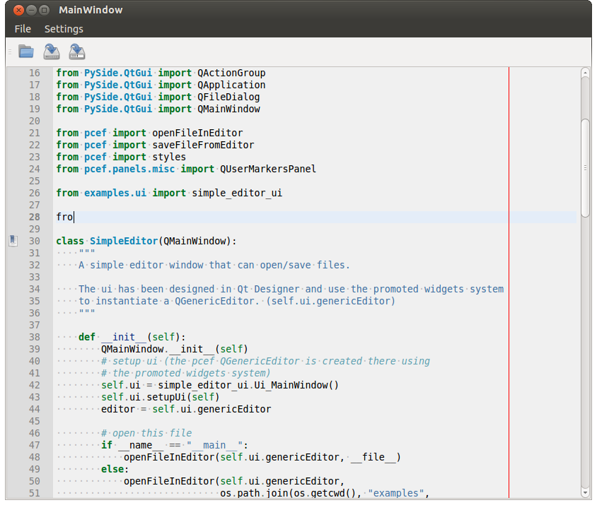
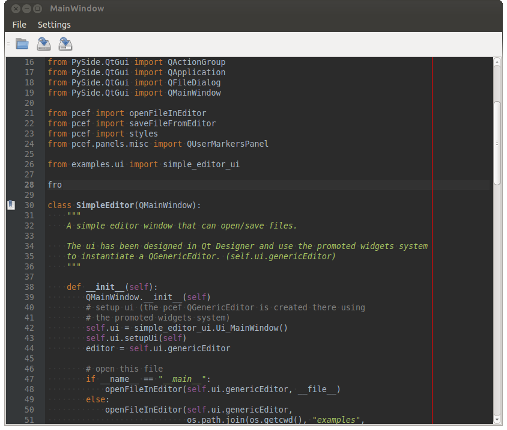

.. pyQode - Python/Qt Code Editor widget
.. Copyright 2013, Colin Duquesnoy <colin.duquesnoy@gmail.com>

.. This document is released under the LGPLv3 license.
.. You should have received a copy of the GNU Lesser General Public License
.. along with this program. If not, see <http://www.gnu.org/licenses/>.

Welcome to PCEF documentation!
=======================================

Welcome to the PCEF documentation!

What is PCEF?
---------------

PCEF is code editing framework for PySide applications. It provides a flexible code editor ready to use in any PySide
applications. Flexibility is achieved through a system of editor extensions (custom panels and modes).

At the moment, the framework only provides a generic code editor (language independent) but plans are to at least
provides full support for python and maybe c++.

Here are the core features:

 * **syntax highlighting mode** (using pygments)
 * **code completion** (static word list, from document words)
 * line number Panel
 * **code folding** Panel
 * markers Panel (to add breakpoints, bookmarks, errors,...)
 * right margin indicator mode
 * active line highlighting mode
 * **editor zoom** mode
 * find and replace Panel
 * **text decorations** (squiggle, box)
 * unicode support (specify encoding when you load your file)
 * **easy styling** (built-in white and dark styles + possibility to customize using **JSON style schemes**)
 * **flexible framework** to add custom panels/modes
 * auto indent mode(indentation level is based on the previous line indent)

And here are some screenshots (taken from the generic_example v.0.1):

Parts of the documentation:
-----------------------------------

.. toctree::
    :maxdepth: 1
    :hidden:

    whats_new
    download
    getting_started
    advanced
    examples
    changelog
    api/api_doc
    bugs
    contribute
    license
    credits

.. hlist::
   :columns: 2

   * .. glossary::

      :doc:`whats_new`
         What's new since the last release, and what is planned for the next one.

   * .. glossary::

      :doc:`download`
         Instructions on where and how to install PCEF.

   * .. glossary::

      :doc:`getting_started`
         An introduction to PCEF, covering some basic principles.

   * .. glossary::

      :doc:`advanced`
         Cover advanced topics such as styling, creating custom modes and panels and so on.

   * .. glossary::

      :doc:`examples`
         Practical examples demonstrating how to use the framework.

   * .. glossary::

      :doc:`api/api_doc`
         The api reference documentation

Meta information:
--------------------

.. hlist::
   :columns: 2

   * .. glossary::

      :doc:`bugs`
        How to report bugs

   * .. glossary::

      :doc:`contribute`
        How to contribute

   * .. glossary::

      :doc:`license`
        PCEF license

   * .. glossary::

      :doc:`credits`
        Credits to contributors and external libraries

Indices and tables:
----------------------

* :ref:`genindex`

* :ref:`search`
